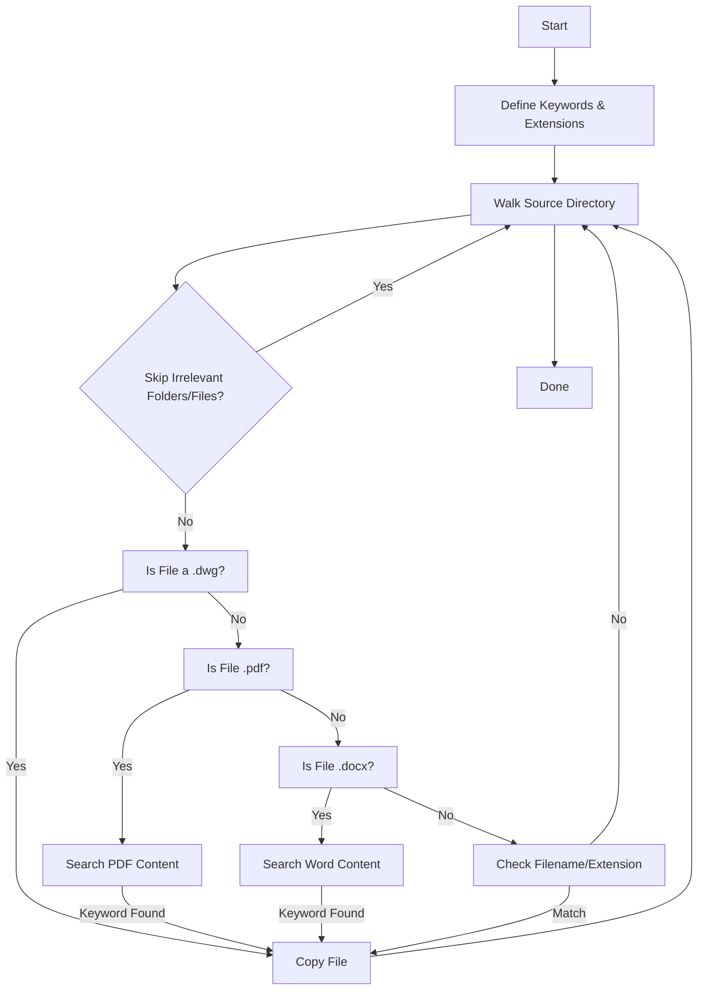

# DocHarvester: Automated and Accelerated File Searching and Copying

## Project Overview

**DocHarvester** is a Python-powered tool designed to automate and accelerate the process of finding and organizing critical project documents. It is purpose-built for engineering and environmental projects, but is flexible enough for any scenario requiring fast, reliable document retrieval across large, complex directory structures.

### Problem to Solve

Our team needed background information from past AE projects on wetland treatment design to inform a new design. Manually searching File Explorer for records, analyses, and reports was inefficient and increased the risk of missing critical documents.

### Approach

DocHarvester automates searching for wetland project documentation by scanning directories in File Explorer and filtering by keywords in the project title and the file contents (e.g., "wetland," "treatment," "design"). The tool also selects relevant file extensions (.pdf, .docx, .xlsx) to search through. I used the AE file naming convention document to select file extensions to look through. It skips irrelevant files based on predefined terms and organizes extracted documents into project folders.

### Results

DocHarvester reduced the time for file searching by over 90%. It enhances project workflows by ensuring quick access to critical files, reducing the risk of missing information, and allowing engineers to focus on more problem-solving work.

---

## Key Features

- **Automated Search:** Scans specified source directories for files containing project-relevant keywords.
- **Content-aware Filtering:** Searches inside PDF and Word files for important terms.
- **Extension Filtering:** Focuses on key file types (.pdf, .docx, .dwg, .xlsx, etc.) using AE's documented conventions.
- **Advanced Skipping Logic:** Avoids copying files and folders known to be irrelevant (like invoices, emails, resumes, temporary files, etc.).
- **Parallel Processing:** Uses all available CPU cores for fast scanning.
- **Automated Organization:** Copies matched files into a well-organized destination directory for easy access and project archiving.
- **Logging:** Provides progress updates and error messages to help users monitor and troubleshoot the process.

---

## How DocHarvester Works

The tool follows these main steps:

1. **Define What to Search For:**  
   Looks for filenames and file contents containing important keywords (e.g., "wetland", "design", "report") and specific file types (e.g., .pdf, .docx, .dwg).

2. **Set Source and Destination:**  
   You specify where to search (source directories) and where to copy found files (destination directory).

3. **Scan and Filter:**  
   Walks through all folders and files, skipping those in the skip lists, and checks each file for keywords and supported file types.

4. **Content Search:**  
   - **PDFs:** Uses `pdfminer.six` to extract text and search for keywords.
   - **Word Documents:** Uses `python-docx` to scan paragraphs for keywords.

5. **Copy Files:**  
   All matching files are copied to a dedicated folder in your destination directory.

6. **Logging:**  
   Progress and errors are logged for easy troubleshooting.

---

## Example Workflow

Below is a simplified flowchart illustrating DocHarvester’s logic:



---

## Key Code Sections Explained

### 1. **Keyword & Extension Setup**

```python
keywords = set([...])
file_extensions = [".dwg", ".docx", ".pdf", ...]
```
Defines what DocHarvester will look for—customizable to your project's needs.

### 2. **Skipping Irrelevant Files and Folders**

```python
skip_words = set([...])
skip_folders = set([...])
# Skips files and folders with names like "invoice", "resume", "email", etc.
```

### 3. **Searching PDFs and Word Docs**

#### PDF Searching:
```python
def search_pdf(file_path, keywords):
    text = extract_text(file_path)
    return any(keyword in text.lower() for keyword in keywords)
```
Extracts text from PDF and searches for any keyword.

#### Word Document Searching:
```python
def search_docx(file_path, keywords):
    doc = docx.Document(file_path)
    for para in doc.paragraphs:
        if any(keyword in para.text.lower() for keyword in keywords):
            return True
```
Checks each paragraph for keywords.

### 4. **Parallel Directory Scanning**

```python
with concurrent.futures.ThreadPoolExecutor(max_workers=cpu_count()) as executor:
    futures = [executor.submit(search_files, source_directory, keywords, file_extensions) for source_directory in source_directories]
```
Scans directories in parallel for speed.

### 5. **Copying Matched Files**

```python
def copy_files(files, destination_directory, project_name):
    project_folder = os.path.join(destination_directory, project_name)
    os.makedirs(project_folder, exist_ok=True)
    for file in files:
        shutil.copy(file, project_folder)
```
Copies files to a project-specific folder in the destination.

---

## Sample Screenshot

Below is a sample screenshot showing DocHarvester’s output in the terminal, displaying progress and copied files:


---

## Prerequisites

- **Python 3.7 or higher**
- **Required Libraries:**  
  - `pdfminer.six` (for PDF text extraction)
  - `python-docx` (for reading Word documents)
  - Standard libraries: `os`, `shutil`, `fnmatch`, `logging`, `concurrent.futures`, `multiprocessing`
- **Network Access:**  
  - The script assumes you have access to the specified network drive paths.

### Installation

```bash
pip install pdfminer.six python-docx
```

---

## How to Use DocHarvester

1. **Configure Directories:**  
   Edit the `source_directories` and `destination_directory` variables in the script to match your environment.

2. **Set Project Name:**  
   Change the `project_name` variable as needed.

3. **Run the Script:**  
   Execute the script from your command line:
   ```bash
   python script_name.py
   ```
   (Replace `script_name.py` with your actual file name.)

4. **Check Output:**  
   Look in your destination directory for a folder named after the project, containing all matched files.

---

## Troubleshooting

- **Permission Errors:**  
  Ensure you have read access to the source directories and write access to the destination directory.
- **Missing Libraries:**  
  If you see `ModuleNotFoundError`, install missing packages using `pip`.
- **Network Issues:**  
  Make sure the source and destination paths are reachable from your computer.
- **File Not Found:**  
  Some files may be listed but not actually present—these will be skipped with a log message.

---

## For Non-Technical Users

- You do **not** need to understand Python to use DocHarvester—just follow the steps above.
- All copying and searching is automatic.
- If you need help, contact your IT team or the project’s technical lead.

---

## License

This script is provided under the MIT License. See [LICENSE](LICENSE) for details.

---

## Disclaimer

This tool is intended to assist with project document management. Always verify that copied files are complete and relevant. Use responsibly within your organization’s data policies.

